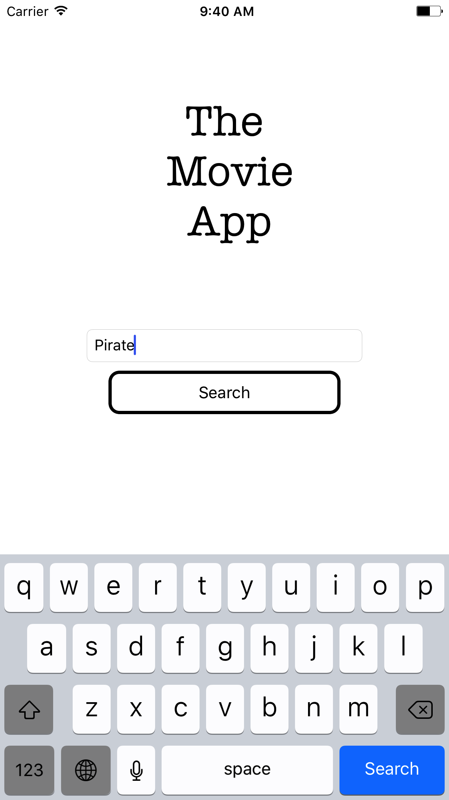
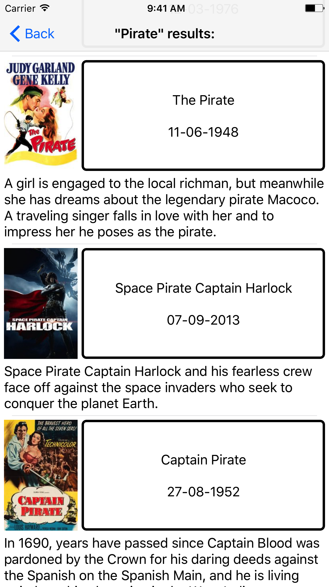
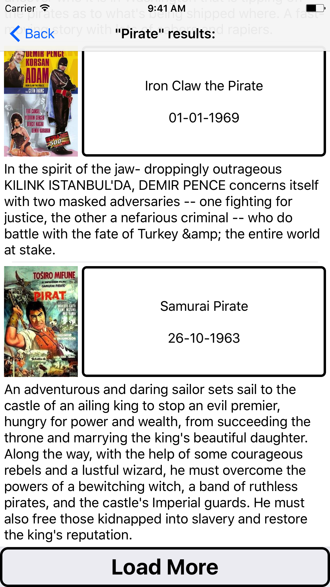
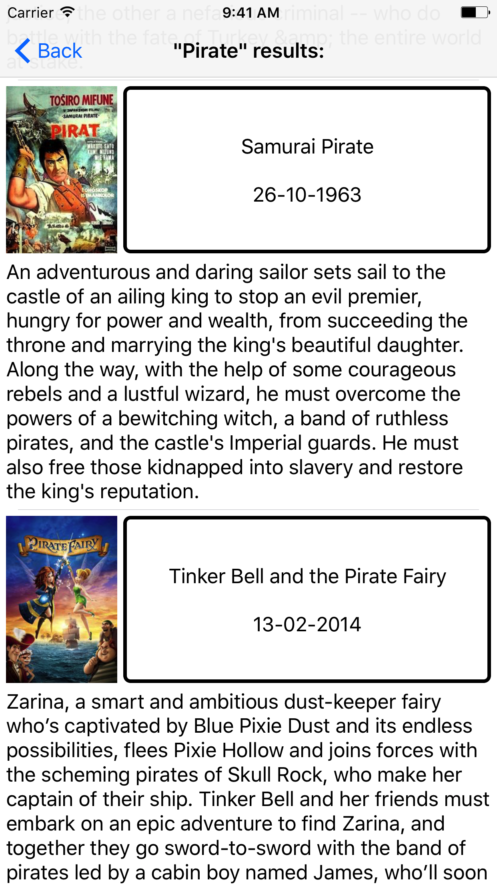

# The Movie App #

### Screens ###

<table>
  <tr>
    <td>
      
      
      
      
    </td>
  </tr>
</table>

### External Libraries used: ###

3 external pods have been used:

1. Alamofire v4.4.0
1. AlamofireObjectMapper v4.1.0
1. SDWebImage v3.8.2

After downloading the source, you need to "cd" to the root folder and make a pod install by typing in  "pod install" to the root. After that, you may use the .xcworkspace file to open the project in XCode. Fore more on cocoapods, check [here](https://cocoapods.org/).

### General architecture: ###

The app relies mainly on the [VIPER](http://clean-swift.com/clean-swift-ios-architecture/) architecture, which is an implementation of the iOS CLEAN architecture

As a result of it, there are 3 VIPER modules:

* The first is the Root Module, which is simply an entry router to the app. 
* The second is the Search Module, handling the search screen and the suggestions mostly
* The third is the result list screen, which handles the interactions in that screen.

The delegates and data sources are implemented in extensions with the naming convention: <<View Controller's Name>>_<Delegate's Name> or <<View Controller's Name>>_<Datasource's Name> to make the code more readable and easier to maintain and work with.

There's no loading screen but if required, it can be easily implemented using [SVProgressHUD](https://github.com/SVProgressHUD/SVProgressHUD) 

### Tests: ###

There are a total of 6 unit tests in the The_Movie_AppTests.swift file. All of them must pass with the latest version of the code. The developmental approach in producing the tests was a test-last.
